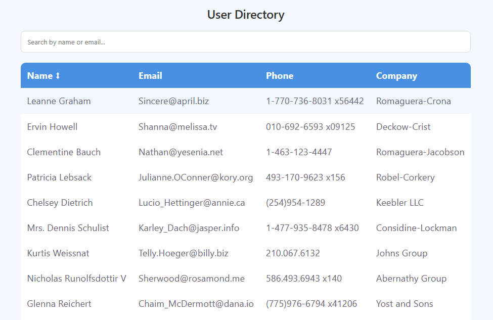

# 📊 User Directory Dashboard

A responsive React-based User Directory Dashboard that allows users to view, search, sort, and explore user details fetched from an external API.

---

## 🚀 Features

* 🔍 Search users by **name or email**
* 🔃 Sort users by **name (ascending/descending)**
* 📱 Fully **responsive design (mobile + desktop)**
* 📄 User detail page with full information
* ⚡ Fast API integration using Axios
* 🎯 Clean and modern UI

---

## 🛠️ Tech Stack

* ⚛️ React.js
* 🔀 React Router DOM
* 🌐 Axios
* 🎨 CSS (Custom Responsive Design)

---

## 📁 Project Structure

```
src/
│
├── components/
│   ├── SearchBar.jsx
│   └── UserTable.jsx
│
├── pages/
│   ├── Dashboard.jsx
│   └── UserDetail.jsx
│
├── services/
│   └── api.js
│
├── App.jsx
└── main.jsx
```

---

## 🔌 API Used

* https://jsonplaceholder.typicode.com/users

---

## ⚙️ Installation & Setup

1. Clone the repository:

```
git clone https://github.com/your-username/user-directory-dashboard.git
```

2. Navigate to project folder:

```
cd user-directory-dashboard
```

3. Install dependencies:

```
npm install
```

4. Run the development server:

```
npm run dev
```

---

## 📱 Responsive Design

* Desktop → Table layout
* Mobile → Card layout
* Optimized for all screen sizes

---

## 📸 Screenshots

> 

---

## ✨ Future Improvements

* 📄 Pagination
* 🌙 Dark Mode
* ⚡ Debounced Search
* 🧠 State Management (Redux/Context API)
* 🔐 Authentication

---

## 🙌 Acknowledgements

* Data provided by JSONPlaceholder API
* https://jsonplaceholder.typicode.com/users

---

## 📌 Author

**Mahesh Balagonda**

* 💼 Aspiring Frontend Developer
* 📧 mahesh144b@gmail.com
* 🔗 https://github.com/balagonda143

---

## ⭐ If you like this project

Give it a ⭐ on GitHub and share your feedback!

---
